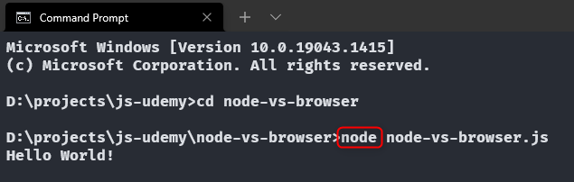
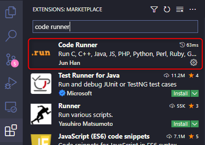
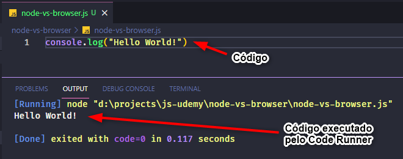
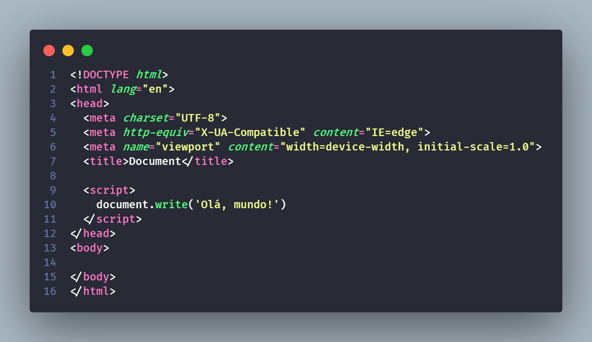

<h1>node vs browser</h1>

<ul>
Os códigos em JS podem ser executados via <strong>terminal</strong>, sendo duas maneiras possíveis:

1. Com o comando ``` node ```, utilizando a instalação do V8 feita na máquina. Neste caso, basta localizar o diretório do arquivo e fazer a chamada ao mesmo, precedido pelo comando ``` node ```.

<figure style="text-align:center">
  
  <figcaption>Execução de código com o comando node</figcaption>
</figure>

2. Via terminal integrado do VS Code, utilizando o atalho  ``` Ctrl + Shift + ' ``` para abrir o terminal e  ``` Ctrl + Alt + N ``` para executar o código. Para que isso funcione, deve-se instalar a extensão Code Runner no VS Code.
    * Instalação do Code Runner

    * Execução do código com o Code Runner (utilizando o comando ``` Ctrl + Alt + N ```)


Outra forma de executar o JavaScript é pelo browser. Isso pode ser feito também de várias maneiras:
* Criando um arquivo HTML e utilizando a tag ``` <script> ``` para digitar o script a ser rodado pelo browser.
<figure style="text-align:center">
  
  <figcaption>Teste</figcaption>
</figure>

Código JS dentro da tag ``` script ```

